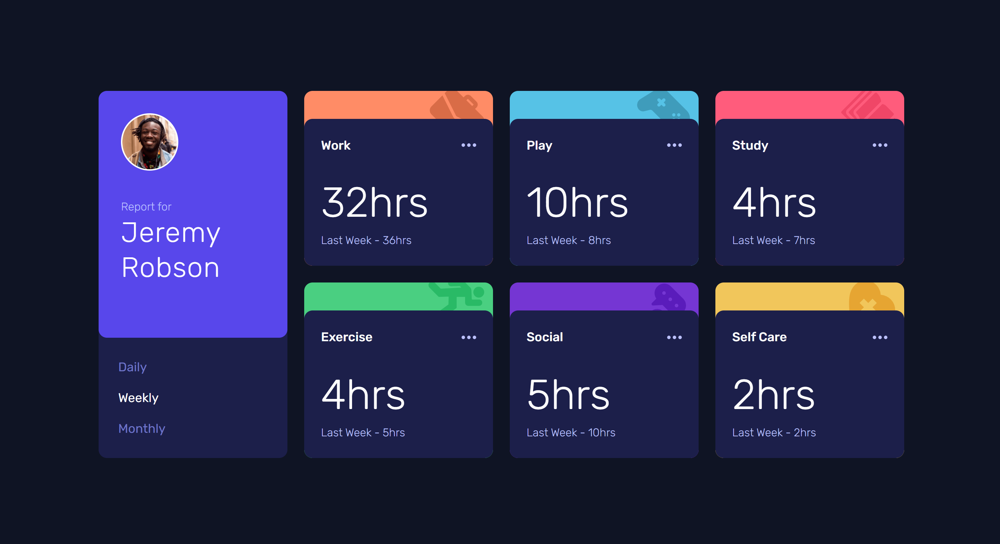
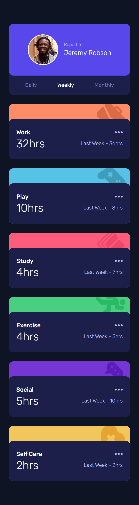

# Hi Everyone!👋

I developed this Junior level challenge which really helped be more comfortable in using Tailwind CSS

- Check out the link for this project: [https://jcasia-time-tracking-dashboard.netlify.app/](https://jcasia-time-tracking-dashboard.netlify.app/)

### I built this project using:

- React
- Tailwind CSS
- A little bit of Framer Motion

### Here are some screenshots of the project:

